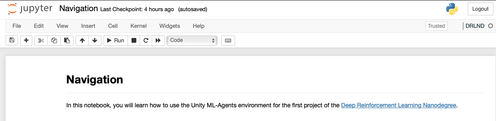

# Deep Reinforcement Learning: Continuous Control

I completed this project as part of [Udacity](https://www.udacity.com)'s [Deep Reinforcement Learning Nanodegree](https://www.udacity.com/course/deep-reinforcement-learning-nanodegree--nd893).

The goal of this project is to solve the Unity ML-Agents Reacher Environment.


In this environment, a double-jointed arm can move to target locations. A reward of +0.1 is provided for each step that the agent's hand is in the goal location. Thus, the goal of your agent is to maintain its position at the target location for as many time steps as possible.

The observation space consists of 33 variables corresponding to position, rotation, velocity, and angular velocities of the arm. Each action is a vector with four numbers, corresponding to torque applicable to two joints. Every entry in the action vector should be a number between -1 and 1.


# Environment

For this project, there are two separate versions of the Unity environment. 
* The first version contains a single agent.
* The second version contains 20 identical agents, each with its own copy of the environment. 

The second version is useful for algorithms like PPO, A3C, and D4PG that use multiple (non-interacting, parallel) copies of the same agent to distribute the task of gathering experience.


Download the environment that matches your operating system from one of the links below:

- **_Version 1: One (1) Agent_**
    - Linux: [click here](https://s3-us-west-1.amazonaws.com/udacity-drlnd/P2/Reacher/one_agent/Reacher_Linux.zip)
    - Mac OSX: [click here](https://s3-us-west-1.amazonaws.com/udacity-drlnd/P2/Reacher/one_agent/Reacher.app.zip)
    - Windows (32-bit): [click here](https://s3-us-west-1.amazonaws.com/udacity-drlnd/P2/Reacher/one_agent/Reacher_Windows_x86.zip)
    - Windows (64-bit): [click here](https://s3-us-west-1.amazonaws.com/udacity-drlnd/P2/Reacher/one_agent/Reacher_Windows_x86_64.zip)

- **_Version 2: Twenty (20) Agents_**
    - Linux: [click here](https://s3-us-west-1.amazonaws.com/udacity-drlnd/P2/Reacher/Reacher_Linux.zip)
    - Mac OSX: [click here](https://s3-us-west-1.amazonaws.com/udacity-drlnd/P2/Reacher/Reacher.app.zip)
    - Windows (32-bit): [click here](https://s3-us-west-1.amazonaws.com/udacity-drlnd/P2/Reacher/Reacher_Windows_x86.zip)
    - Windows (64-bit): [click here](https://s3-us-west-1.amazonaws.com/udacity-drlnd/P2/Reacher/Reacher_Windows_x86_64.zip)

(_For Windows users_) Check out [this link](https://support.microsoft.com/en-us/help/827218/how-to-determine-whether-a-computer-is-running-a-32-bit-version-or-64) if you need help with determining if your computer is running a 32-bit version or 64-bit version of the Windows operating system.

(_For AWS_) If you'd like to train the agent on AWS (and have not [enabled a virtual screen](https://github.com/Unity-Technologies/ml-agents/blob/master/docs/Training-on-Amazon-Web-Service.md)), then please use [this link](https://s3-us-west-1.amazonaws.com/udacity-drlnd/P2/Reacher/one_agent/Reacher_Linux_NoVis.zip) (version 1) or [this link](https://s3-us-west-1.amazonaws.com/udacity-drlnd/P2/Reacher/Reacher_Linux_NoVis.zip) (version 2) to obtain the "headless" version of the environment.  You will **not** be able to watch the agent without enabling a virtual screen, but you will be able to train the agent.  (_To watch the agent, you should follow the instructions to [enable a virtual screen](https://github.com/Unity-Technologies/ml-agents/blob/master/docs/Training-on-Amazon-Web-Service.md), and then download the environment for the **Linux** operating system above._)

I store my environment files locally, rather than in GitHub, because they are quite large. This one is 64MB on Mac, for example. 


# Create a Virtual Environment and Install Dependencies
The primary dependencies for this project are:

* [PyTorch](https://pytorch.org)
* [OpenAI Gym](https://gym.openai.com)
* [unityagents](https://pypi.org/project/unityagents/)
* [numpy](https://numpy.org)
* [matplotlib](https://matplotlib.org)

The [requirements.txt](requirements.txt) file contains all dependencies required to run the project code. You can use the [requirements.txt](requirements.txt) to create a virtual environment to run the project code.

For example, I use [Conda](https://docs.conda.io/) to create a virtual environment called `DLRND`, using the following command:

```shell
$ conda create --name DRLND --file requirements.txt
```
Activate the `DLRND` virtual environment:
```
$ conda activate DLRND
(DLRND) $ 
```

# Running the Code

The primary project code is run from the [Continuous_Control.ipynb](Continuous_Control.ipynb) Jupyter Notebook.


Install `ipykernel` if not already installed:
```
(DLRND) $ conda install -c anaconda ipykernel
```

Then, tell `ipykernel` about the `DLRND` conda virtual environment:
```
(DLRND) $ python -m ipykernel install --user --name=DLRND
```

Go to the root directory of your project, and run the `jupyter notebook` command:
```
(DLRND) $ jupyter notebook
```
Once Jupyter starts, select the [Continuous_Control.ipynb](Continuous_Control.ipynb). Go to the Kernel menu, and select the Change kernel option. From there, you should see the `DLRND` environment name listed. After you select the environment name that you want, you will see it displayed in the top right corner of the notebook, as shown here:



From there, you can follow the instructions in the notebook, and step through the notebook to see the DQN implementation in action.


